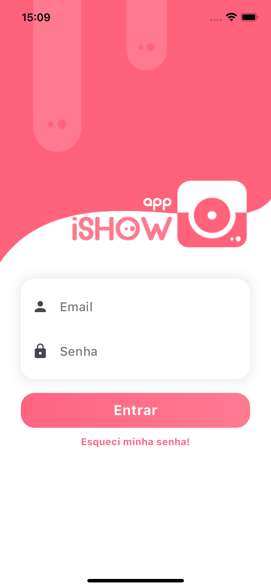

# App Tela de Login Animada

## Descrição

Um aplicativo com uma tela de login animada que foi desenvolvido durante o curso de Desenvolvimento Flutter Mobile.

## Curso

**Desenvolvimento Android e IOS com Flutter - Crie 15 Apps**

[Link para o curso na Udemy](https://www.udemy.com/course/desenvolvimento-android-e-ios-com-flutter/?couponCode=MCLARENT71824)

## Status do Projeto

- **Concluído:** 12/10/2021
- **Atualizado:** 30/07/2024

## Tecnologias Utilizadas


## Funcionalidades

- Tela de login animada

## Instalação

Siga os passos abaixo para rodar o projeto localmente:

1. Clone o repositório:
    ```sh
    git clone https://github.com/rafaelleonan/app-flutter-login-animado.git
    ```
2. Navegue até o diretório do projeto:
    ```sh
    cd app-flutter-login-animado
    ```
3. Instale as dependências:
    ```sh
    flutter pub get
    ```
4. Execute o aplicativo:
    ```sh
    flutter run
    ```

## Telas
<p>
  
</p>

## Video Demonstração
[Assista o vídeo](https://ucdd98c7165fd65bf03f528e124b.dl.dropboxusercontent.com/cd/0/inline/CXzHiCP-neQfqqFH3f2GSAyTLRiv7k8dNLVJOgQiiTJV58HCfyLiPiJCpOj8hc0ZQibLbAn5qGLl06w_DeMPnDbLDz0VNGzIVhn9GWNzA-DjhjVYpWzqoMPICw2AwBhQ0RwGhkYKXz4OegLbRa8eTB_J/file#)
